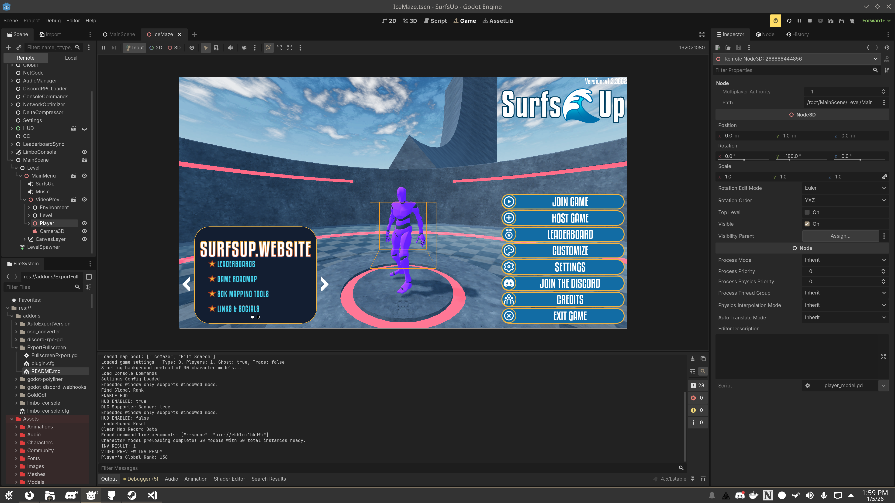

# Fullscreen Export

A Godot 4 editor plugin that automatically sets your project's window mode to fullscreen during export, then reverts back to the original mode once the export completes.

## YouTube Video Walkthrough
[](https://www.youtube.com/watch?v=JNc0fjZ45iA)


## Why Use This Plugin?



While I work on my Godot projects I prefer to play in Windowed mode embedded in the editor. This allows me to read logs and interact with the remote tree while still playing the game from a single window. **But** I always forget to switch the window settings back to Fullscren when exporting a build. I end up having to export and ship *another patch* just to set the project's window mode to fullscreen.

**So I decided to automate this with an export plugin** and thought I could share it with you!

## Features

- Automatically sets window mode to **Exclusive Fullscreen** (mode 4) during export
- Easily change the export from Exclusive (4) to Fullscreen (3)
- Restores the original window mode after export completes
- Handles export failures gracefully
- Provides console feedback about window mode changes
- Staticly typed and commeted GDScript
- Zero configuration required, just enable the plugin from project settings

## Installation

1. Copy the `FullscreenExport` folder to your project's `addons` directory:
   ```
   your_project/
   └── addons/
       └── FullscreenExport/
           ├── FullscreenExport.gd
           └── plugin.cfg
   ```

2. Enable the plugin in Godot:
   - Go to **Project -> Project Settings -> Plugins**
   - Find **Fullscreen Export** in the list
   - Check the **Enable** checkbox

## Usage

Once enabled, the plugin works automatically. Simply export your project as you normally would:

1. Go to **Project → Export**
2. Configure your export preset (if not already done)
3. Click **Export Project** or **Export All**

The plugin will:
- Detect the current window mode setting
- Change it to exclusive fullscreen (mode 4)
- Save the project settings
- Complete the export
- Restore your original window mode

You'll see console messages during export:
```
ExportFullscreen: Set window mode to exclusive fullscreen for export (original: 0)
ExportFullscreen: Restored window mode to 0
```

## Window Modes

The plugin sets the window mode to **Exclusive Fullscreen** (mode 4). If you prefer regular fullscreen (mode 3), you can modify line 11 in [FullscreenExport.gd](FullscreenExport.gd#L11):

```gdscript
const WINDOW_MODE_FULLSCREEN: int = 3  # Change from 4 to 3
```

[Available modes](https://docs.godotengine.org/en/4.5/classes/class_displayserver.html#enum-displayserver-windowmode):
- `0` - Windowed
- `1` - Minimized
- `2` - Maximized
- `3` - Fullscreen
- `4` - Exclusive Fullscreen


## License

[MIT License](LICENSE.md). This plugin is provided as-is for use in your projects.

## Author

[Mark Arneman](https://arneman.me) aka [bearlikelion](https://bearlikelion.com)

## Troubleshooting

**The plugin doesn't seem to work:**
- Make sure the plugin is enabled in Project Settings -> Plugins
- Check the console for any error messages during export

**My window mode isn't being restored:**
- This should only happen if the export process crashes
- You can manually change the window mode in Project Settings -> Display -> Window -> Size -> Mode

**I want to use a different fullscreen mode:**
- Edit the `WINDOW_MODE_FULLSCREEN` constant in [FullscreenExport.gd](FullscreenExport.gd#L11) (see Window Modes section above)
